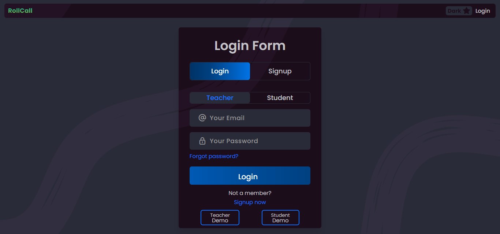
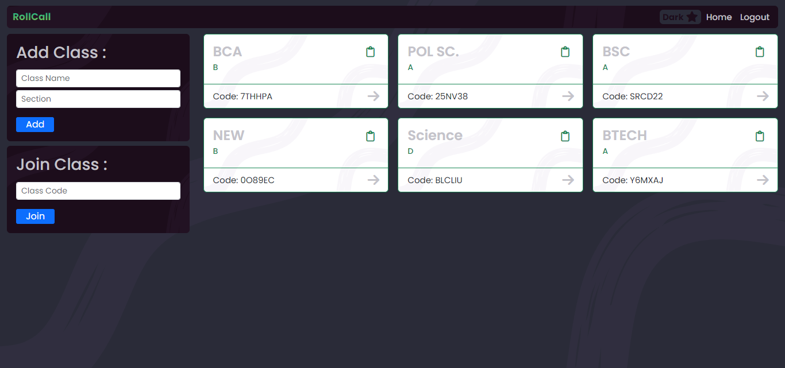
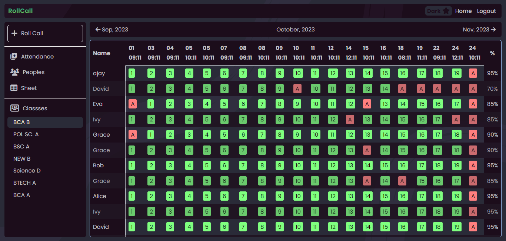
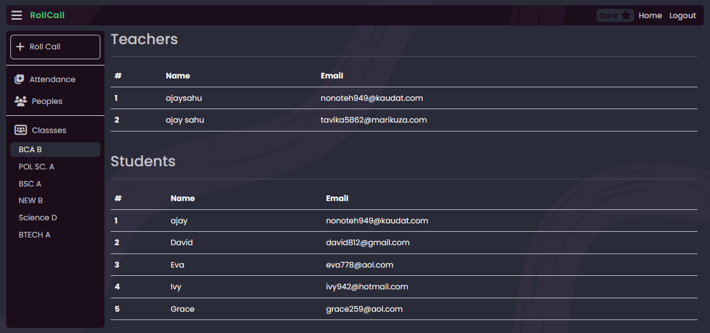

# Roll Call - Attendance Management System

## Table of Contents
- [Live Demo](#live-demo)
- [Description](#description)
- [Screenshots](#screenshots)
- [Installation](#installation)
- [File Structure](#file-structure)
- [Usage](#usage)
- [Contributing](#contributing)
- [License](#license)

## Live Demo

You can check out the live demo of Roll Call at the following link: <a href="https://rollcall.epizy.com/">Roll Call Demo</a>

## Description

Roll Call is an open-source Attendance Management System built with PHP and Bootstrap. It provides a simple and efficient way to manage attendance for schools, colleges, or any organization. This system allows you to track and maintain attendance records with ease.

## Screenshots








## Installation

To set up Roll Call on Computer, follow these steps:

1. **Clone the repository:**

   ```bash
   git clone https://github.com/anaysah/Attendance-System-PHP.git
   ```

2. **Navigate to the project directory:**

   ```bash
   cd roll-call
   ```
3. **Import the database schema:**

   Create a database and import the SQL file located at `database_setup.sql`. You can use xampp phpmyadmin to create and import the database

4. **Config dbh.inc.php file**

   Configure the database settings in `includes/dbh.inc.php`. This file is responsible for database connectivity. Change the values according your mysql server. (serverName, DBusername, DBpass, DBname) These four values you have to change according your database.

5. **Start the web server:**

   You can use xampp and place the folder in htdocs to access the website or can use the php development server. Remember to start both apache and mysql in xampp control panal if you are using xampp.

6. **Access the application:**

   Open a web browser and go to localhost.

## File Structure

1. **includes**
   - These are files are not directly used to show the content but used to process the data. Every includes file have `.inc` before the file extension.
2. **templates**
   - These files are used to create ui and used to extend other files. These are the small parts which are used to make the whole page.
3. **js, styles, images**
   - These are the assest folder and have static code or data in to it.
4. **student and teacher**
   - These folder contain UI content to show.
- **Note.** There is a `.htaccess` file in the root dir. This file forces to use https in hosted environment. You can remove it if you only in development.

## Usage

1. **Logging in:**

   - Log in as Teacher or Student.

2. **Teachers Dashboard:**

   - Create classes and class link.
   - Take attendance.
   - View attendance statistics.
   - Have students data.
   - Attendance sheet month vise

3. **Student Dashboard:**

   - View your attendance.
   - See other students in your class.

## Contributing

We welcome contributions from the community. If you want to contribute to Roll Call you are welcome.

## License

This project is licensed under the [MIT License](LICENSE).

---

Happy attendance management! 📚👩‍🏫👨‍🏫